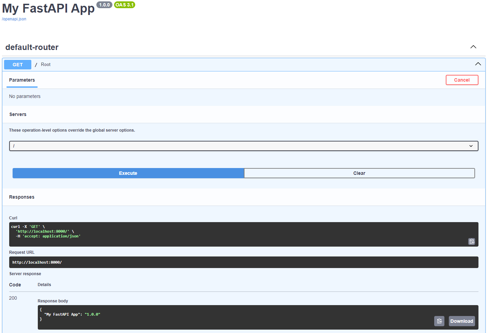
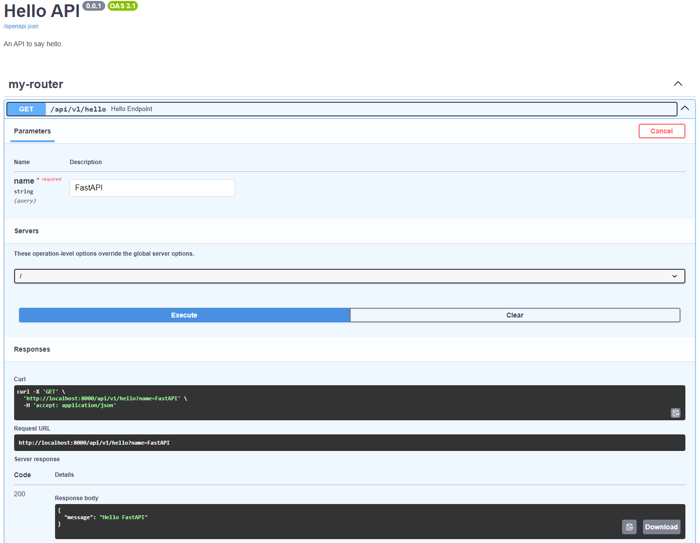

FastAPI Helpers module contains wrapper classes for FastAPI routes, routers and apps. 

```python

{!./docs_src/fastapi_helpers/basic_app/main.py!}

```

Assuming that you put this code snippet in *main.py*, you can run it by:

<!-- termynal -->

```shell
$ fastapi run main.py
```

And this is what you will get at "http://localhost:8000/docs:



This was a basic application that contains only the default route that I include in the app. But if you don't want to include it, and create your own routers and routes:

```python

{!./docs_src/fastapi_helpers/adding_routers/main.py!}

```

And when you run it, you will get:

